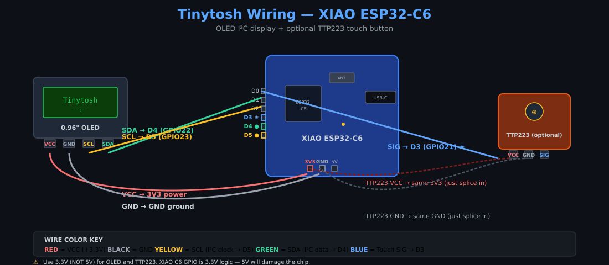

# Tinytosh on XIAO ESP32-C6 — Build & Flash Guide

This fork/branch adds native support for the **Seeed XIAO ESP32-C6** to the
Tinytosh firmware. The original project targets the ESP32-C3 SuperMini; this
guide covers the changes needed for the C6 variant.

> **You are looking at a C6 variant.** For the original C3 guide, see
> <https://vladimirgitsarev.github.io/Tinytosh/>.

---

## What's different vs the C3 build

| Concern | C3 (original) | XIAO ESP32-C6 |
|---|---|---|
| **Board** | ESP32-C3 SuperMini | Seeed XIAO ESP32-C6 |
| **Default I²C** | SDA = GPIO 8, SCL = GPIO 9 | SDA = D9 (GPIO 20), SCL = D10 (GPIO 18) |
| **Default touch** | GPIO 10 | D3 (GPIO 21) |
| **Battery readout** | not supported | ✅ Reads BAT pad via ADC (A0/GPIO0 + 1:2 divider) |
| **GPIO range exposed in web panel** | 0..21 | 0..30, with ⚠️ markers on strapping/flash/USB pins |
| **USB serial** | Hardware UART over USB-CDC | **USB CDC On Boot must be Enabled** |
| **Arduino core** | esp32 v2.x or v3.x | **esp32 v3.0.0+** (C6 support was incomplete before) |
| **Web flasher manifest** | `manifest.json` (chipFamily: ESP32-C3) | `manifest_c6.json` (chipFamily: ESP32-C6) |
| **First-flash procedure** | Just plug in | Just plug in (if no port appears, hold **BOOT** while plugging in USB, release after ~2 s) |
| **Build flag** | none | `-DTINYTOSH_BOARD=XIAO_ESP32_C6` |

---

## Wiring (XIAO ESP32-C6)

The OLED and optional TTP223 touch sensor wire to the XIAO's standard I²C pair:

| Component | Pin | XIAO C6 connection |
|---|---|---|
| OLED VCC | — | **3V3** |
| OLED GND | — | **GND** |
| OLED SCL | — | **D10** (GPIO 18) |
| OLED SDA | — | **D9** (GPIO 20) |
| Touch VCC | — | **3V3** (NOT 5V) |
| Touch SIG | — | **D3** (GPIO 21) |
| Touch GND | — | **GND** |

You can reassign any of these in the web panel — the C6 build exposes GPIO 0–30
with warnings on pins the firmware considers risky (strapping, flash, UART).

### Pins the auto-pick avoids on C6

The firmware's `validatePins()` will not pick these for I²C or touch:

- `GPIO 3, 14` — RF switch / antenna select (firmware-managed at boot)
- `GPIO 4, 5, 6, 7` — JTAG pads on the back of the XIAO
- `GPIO 8, 9` — ESP32-C6 strapping pins
- `GPIO 15` — ESP32-C6 strapping pin (JTAG MTDO)
- `GPIO 16, 17` — UART0 TX/RX (used by USB-CDC serial monitor)
- `GPIO 18, 19` — connected to internal flash (FSPIQ, FSPID)

You can still override any pin manually in the web panel if you know what
you're doing — the ⚠️ marker is a hint, not a wall.

---

## Option A — Web Flasher (easiest)

1. Open the GitHub Pages site for this branch:

   ```
   https://karbonxx.github.io/Tinytosh-C6/
   ```
2. Plug your XIAO C6 into USB-C.
3. Click **Connect & Flash XIAO ESP32-C6**.
4. Pick the serial port that appears, click **Install**, wait ~60 seconds.
5. Done — the OLED should show "Tinytosh is Ready".

> **First-flash procedure:** Just plug in. If the web installer can't see a
> serial port on the first try, **hold the BOOT** button on the XIAO while
> plugging in, then release after ~2 seconds. This forces the ROM bootloader.
> Subsequent flashes work without this step.

The web installer uses the [ESP Web Tools](https://esptool-js.github.io/esp-web-tools/)
component, which talks directly to your browser's WebSerial API. No drivers
needed (the XIAO C6 uses native USB).

---

## Option B — Arduino IDE

### Board settings

| Setting | Value |
|---|---|
| Board | `XIAO_ESP32C6` (or `ESP32C6 Dev Module` if XIAO variant not listed) |
| USB CDC On Boot | **Enabled** |
| CPU Frequency | 160 MHz |
| Flash Frequency | 80 MHz |
| Flash Mode | QIO |
| Flash Size | 4MB (32Mb) |
| Partition Scheme | **Huge APP (3MB No OTA/1MB SPIFFS)** — required, the default 1.2MB partition is too small |
| Upload Speed | 921600 |

### Build flag

In **Tools → ...** add the following to `build.extra_flags`:

```
-DTINYTOSH_BOARD=XIAO_ESP32_C6
```

### Libraries (same as C3 build)

| Library | Author | Install via |
|---|---|---|
| WiFiManager | tzapu | Library Manager (use 2.0.16-rc.2 — see "Known issues" below) |
| ArduinoJson | Benoit Blanchon | Library Manager |
| Adafruit SSD1306 | Adafruit | Library Manager (install all dependencies) |
| Adafruit GFX Library | Adafruit | Library Manager |
| OneButton | Matthias Hertel | Library Manager |
| PubSubClient | Nick O'Leary | Library Manager |

### Known issues with library compatibility

ESP32 Arduino Core v3.x renamed `ESP32` to `ARDUINO_ARCH_ESP32`, which breaks
older libraries that use `#ifdef ESP32` guards. The following patches are
needed if you hit compile errors:

| File | Fix |
|---|---|
| `Adafruit_SSD1306.cpp` | Add `\|\| defined(ARDUINO_ARCH_ESP32)` to the `util/delay.h` guard |
| `Adafruit_BusIO/Adafruit_SPIDevice.h` | Same: `defined(ESP32) \|\| defined(ARDUINO_ARCH_ESP32)` |
| `WiFiManager.h` & `.cpp` | Replace all `defined(ESP32)` with `defined(ESP32) \|\| defined(ARDUINO_ARCH_ESP32)`; replace `WiFi.hostname()` (0-arg) with `WiFi.getHostname()`; replace `system_get_sdk_version()` with `esp_get_idf_version()`; fix `HTTP_INFO_chiprev`/`HTTP_INFO_aphost` typos; replace `AUTH_MODE_NAMES[]` with a switch on `wifi_auth_mode_t`; rewrite the `WiFiEvent` callback registration using a lambda |

For a clean reproducible build, use the [`arduino-cli` recipe](#option-c--platformio)
or the **arduino-cli one-liner** below — it handles the patches automatically.

### arduino-cli one-liner (recommended for headless builds)

```bash
arduino-cli compile \
  --fqbn "esp32:esp32:XIAO_ESP32C6:UploadSpeed=921600,CDCOnBoot=cdc,PartitionScheme=huge_app" \
  --build-property "build.extra_flags=-DTINYTOSH_BOARD=XIAO_ESP32_C6" \
  --output-dir build/output \
  TinytoshESP32/TinytoshESP32.ino
```

Output: `build/output/TinytoshESP32.ino.merged.bin` — this is your `Tinytosh-C6.bin`.

---

## Option C — PlatformIO

`platformio.ini` snippet:

```ini
[env:xiao-esp32c6]
platform = espressif32
board = esp32-c6-devkitc-1
framework = arduino
monitor_speed = 115200
upload_speed = 921600
board_build.partitions = huge_app.csv
build_flags = -DTINYTOSH_BOARD=XIAO_ESP32_C6
```

The `board_build.partitions = huge_app.csv` line is **required** — the default
1.2 MB partition is too small for Tinytosh on the C6.

Then:

```bash
pio run -e xiao-esp32c6 -t upload
pio device monitor
```

---

## Generating the C6 firmware .bin for the web flasher

The web flasher expects `Tinytosh-C6.bin` next to `manifest_c6.json`. To
produce it:

### From Arduino IDE

1. **Sketch → Export Compiled Binary** (with the XIAO C6 board + build flag set).
2. The .bin lands in your sketch folder. Rename it to `Tinytosh-C6.bin`.

### From PlatformIO

```bash
pio run -e xiao-esp32c6
# Output: .pio/build/xiao-esp32c6/firmware.bin
cp .pio/build/xiao-esp32c6/firmware.bin Tinytosh-C6.bin
```

### From esptool (merging partitions for a single-file flash)

```bash
python3 -m esptool --chip esp32c6 merge_bin \
  --output Tinytosh-C6.bin \
  --flash_mode dio --flash_size 4MB \
  0x0   .pio/build/xiao-esp32c6/bootloader.bin \
  0x8000 .pio/build/xiao-esp32c6/partitions.bin \
  0x10000 .pio/build/xiao-esp32c6/firmware.bin
```

(Replace `--flash_mode dio` with `qio` if your C6 variant uses QIO flash —
the XIAO C6 typically uses **QIO**.)

---

## Deploying the web flasher to GitHub Pages

```bash
git checkout -b feature/xiao-esp32-c6
git add firmware/ index.html style.css script.js manifest.json manifest_c6.json
git commit -m "Add XIAO ESP32-C6 support + web flasher"
git push origin feature/xiao-esp32-c6

# Enable GitHub Pages on this branch at / (root)
gh repo edit --enable-pages --pages-source-branch feature/xiao-esp32-c6
```

Then visit `https://karbonxx.github.io/Tinytosh-C6/` and the **Connect & Flash
XIAO ESP32-C6** button will be live.

---

## Battery screen (XIAO ESP32-C6 only)

The C6 build adds a new "Battery" screen that reads the BAT pad voltage and
shows it as a percentage + bar icon on the OLED.

### Hardware

Solder a **3.7V LiPo cell** to the BAT+ and BAT- pads on the back of the
XIAO. Use a cell with **built-in over-discharge protection** — the XIAO
ESP32-C6's on-board SGM40567-4.2 charge controller does **not** include
over-discharge protection, and running the cell below 3.0V will damage it
permanently.

The battery voltage is sampled through a **1:2 voltage divider** (200kΩ resistor
between BAT+ and A0/D0/GPIO0). This is the standard Seeed XIAO ESP32-C6
battery-reading mod — the XIAO board's PCB already exposes the divider
pads. No soldering beyond connecting the LiPo cell itself is required for
the voltage reading to work.

### What you see on the OLED

```
   9:41
┌────────────────────┐
│                    │
│   ┌─────────┐▌     │
│   │█████████│▌     │    <- battery icon (filled by %)
│   └─────────┘▌     │
│                    │
│        75%         │    <- percent in big text
│                    │
│      3.85V         │    <- voltage or "Charging (USB)" or "No battery detected"
└────────────────────┘
```

### Web panel

Visit `http://<tinytosh-ip>/` and you'll see a new **Battery** panel with:

- Live charge %, voltage, and status (Charging via USB / On battery / No battery detected)
- A "Battery Screen" checkbox to add/remove it from the rotation
- Drag-to-reorder handle so you can position it anywhere in the cycle

### Battery display math

The firmware maps raw voltage to a 0–100% using a piecewise LiPo discharge
curve:

| Voltage | Percent |
|---|---|
| ≥ 4.20V | 100% |
| 3.85V | 75% |
| 3.70V | 50% |
| 3.55V | 25% |
| 3.30V | 5% |
| < 3.30V | 0% |

Voltage refreshes every 5 seconds in the main loop. Charging is detected
heuristically when BAT ≥ 4.15V (the SGM40567 holds the cell at the
constant-voltage phase).

### Caveats

- **No on-board over-discharge protection** — see warning above. Battery
  percentage assumes a healthy LiPo; if you swap cells or your cell ages,
  recheck the voltage against a multimeter.
- The "charging" heuristic can't tell 100% charged from "charger
  disconnected with a full cell" if BAT stays above 4.15V. Both look
  identical to the firmware.

---

## Wiring reference



**Required connections (OLED to XIAO ESP32-C6):**

| OLED pin | Wire color | XIAO C6 pin | Notes |
|---|---|---|---|
| VCC | red | **3V3** | Power, 3.3V only (not 5V) |
| GND | black | **GND** | Share with TTP223 ground |
| SCL | yellow | **D10** (GPIO 18) | I²C clock |
| SDA | green | **D9** (GPIO 20) | I²C data |

**Optional TTP223 touch button:**

| TTP223 pin | Wire color | XIAO C6 pin |
|---|---|---|
| VCC | red | splice into OLED's red wire (same 3V3) |
| GND | black | splice into OLED's black wire (same GND) |
| SIG | blue | **D3** (GPIO 21) |

## Troubleshooting

### "Web installer can't see my serial port"

- Make sure you're using a **Chromium-based browser** (Chrome, Edge, Opera, Brave).
- WebSerial only works on `localhost` or **HTTPS** — `file://` won't cut it.
- Hold **BOOT** on the XIAO while plugging in, release after 2 s.

### Serial Monitor shows nothing

- `Tools → USB CDC On Boot` must be **Enabled** — this is mandatory for XIAO C6
  since it has no USB-to-serial bridge chip.

### OLED stays blank

- Confirm wiring: SDA → D4, SCL → D5.
- Try re-plugging; the I²C scanner won't run if SDA is shorted to GND.
- The web panel lets you reassign pins — if you moved the OLED to different
  GPIOs, update them there and reboot.

### WiFi keeps dropping on C6

- The XIAO C6's ceramic antenna works well for desk-side setups. If you're in
  a metal enclosure or far from the router, reflowing the antenna-select pad
  and using the U.FL external antenna will help significantly. See Seeed's
  wiki for the antenna-switch procedure.

---

## Credits

Original firmware by **Vladimir Gitsarev** — <https://github.com/VladimirGitsarev/Tinytosh>.
XIAO ESP32-C6 port + web flasher fork by the Tinytosh-C6 contributors.

Licensed under MIT.
